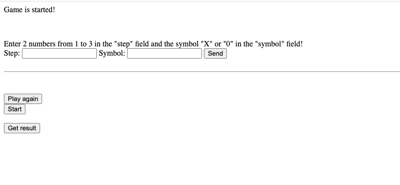

# **Браузерная игра Крестики-нолики**
1. Для реализации использовался **Tomcat 9.0.58**
2. Приложение  разработано с использованием **Spring MVC**
3. Сборщик пакетов - **Maven**
4. Основные методы проекта простированы с помощью **Unit** 
тестов с использованием **Mockito**
5. База данных - **PostgreSQL**
6. Шаги каждой игры записываются в XML и Json файл, которые создаются и обновляются в папке .../apache-tomcat-9.0.58/bin

7. WEB интерфейс игры простой, views написаны с помощью **Thymeleaf**

## *Руководство к игре:*
1. Игра запустится на http://localhost:8080/gameplay - endpoint корневого ресурса
* вводим имя (латинскими буквами) первого игрока (играет крестиком **"X"**)
* вводим имя (латинскими буквами) второго игрока (играет ноликом **"0"**)
* Нажимаем :
```
Start the game TicTacToe
```

## *Играем по инструкции:*
* Поле состоит из 9 клеток
* Необходимо  вводить 2 цифры от 1 до 3(координаты клетки) в поле "step"(шаг) и  "Х" или "0"(по очереди) в поле "symbol" (символ)!
```
координаты клеток:
11|12|13
21|22|23
31|32|33
```

* Чтобы изменить или удалить игрока, нужно вернуться на страницу с добавленными ранее игроками http://localhost:8080/gameplay/players 
и нажать на имя любого существующего игрока.
Вы провалитесь в карточку игрока, в которой можно редактировать его имя. Там же можно удалить игрока. 

* После того, как вы сыграли первую игру вы можете:

а) Продолжить и сыгать еще одну. Для этого нажмите кнопку:
```
Play again
```
и далее нажмите:
```
Start
```
Поле обновиться и можно играть еще раз. Рейтинг игрока сохраняется на протяжении всех игр.

б) Можно получить результат всех игр, нажав на кнопку:
```
Get result
```
(Результат вычитывается из Json файла(Реализацию reader в коде можно поменять на вычитывание из файла XML))

Вид игры в браузере:


